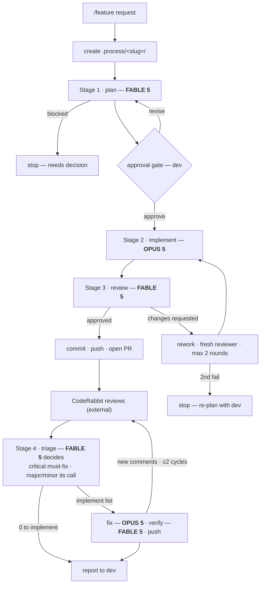

Run the three-stage feature pipeline for: **$ARGUMENTS**

You are the orchestrator. You do not plan, implement, or review yourself — you route, gate, and report. Writing code yourself defeats the entire pipeline.

## Pre-flight — git must be clean (BEFORE anything, including Stage 0)

Run `git status --porcelain` and `git status -sb` first.

- **Any uncommitted change** (modified, staged, or untracked files) → **STOP. Start nothing.** Show the dev the dirty files and tell them to commit or stash first. The pipeline's diffs, reviews, and rework rounds are only trustworthy on a clean tree — a pre-existing change would be attributed to the implementer and reviewed as its work.
- **Unpushed commits** (branch ahead of its upstream) → STOP and surface them the same way; the dev decides whether to push first or explicitly instructs you to proceed despite them.
- Re-run the check after the dev cleans up; only a clean result enters Stage 0.

## Stage 0 — Workflow acceptance (ALWAYS FIRST after pre-flight, no exceptions)

Before anything else, show the dev the pipeline and get explicit acceptance — this workflow changes everything and the dev must consciously enter it.

1. **Show the chart**: render `docs/feature-pipeline.svg` to the dev (attach/render the file if the session supports it; otherwise reproduce the mermaid fallback below).
2. **State the terms in one short block**, with the models unmissable:
   - Stage 1 plan → **`FABLE 5`** · Stage 2 implement → **`OPUS 5`** · Stage 3 review → **`FABLE 5`** (model aliases in `.claude/agents/*.md` frontmatter resolve to the current model of that tier)
   - Two dev gates: plan approval before implementation, and the round-2 stop
   - Rework cap: max 2 review rounds, then re-plan
3. **Ask for acceptance and WAIT.** Only a clear yes proceeds. A "no" or a change request stops the pipeline — surface what they want changed.
4. On acceptance, derive the `<feature-slug>`, create `.process/<feature-slug>/`, and:
   - record the acceptance in `.process/<feature-slug>/00-acceptance.md` (date, feature request, the dev's acceptance reply verbatim);
   - copy `docs/feature-pipeline.svg` to `.process/<feature-slug>/00-pipeline.svg` — a frozen snapshot of the exact flow the dev accepted, so later changes to the pipeline never rewrite this feature's history;
   - create `.process/<feature-slug>/04-metrics.md` with the run-log header (see Metrics below).



## Stage 1 — Plan (**FABLE 5**)

Launch the `feature-planner` subagent with the raw feature request and the slug.

It writes `.process/<feature-slug>/01-plan.md`.

**Gate.** Show the user the plan's *Goal*, *Scope*, *Decisions*, and *Files to create* — not the whole document — and ask for approval before spending an implementation. If the plan comes back `BLOCKED`, stop and surface the decision it needs.

## Stage 2 — Implement (**OPUS 5**)

**Branch first.** Implementation never happens on the current branch directly:

1. Determine the current branch. **If it is not `main`, warn the dev**: the default is to branch from `main`; branching from anything else needs their explicit confirmation ("base it on `<current>` anyway" or "switch to `main` first"). Do not proceed until they choose.
2. Create `feature/<feature-slug>` from the agreed base and check it out. Record the base branch and feature branch in `04-metrics.md`.

Then launch the `feature-implementer` subagent with the path to `01-plan.md` and the slug. Pass the path, not the contents — it must read the plan itself.

**Postman collection is part of every implementation.** The repo-root `postman/e3a.postman_collection.json` (+ local environment file) must always mirror the real API surface: the implementer adds a request for every new endpoint, modifies requests whose contract changed, and deletes requests for removed endpoints — in the same change. An endpoint change without its collection change is an incomplete implementation.

It writes `.process/<feature-slug>/02-implementation.md`.

## Stage 3 — Review (**FABLE 5**)

Launch the `feature-reviewer` subagent with the paths to `01-plan.md` and `02-implementation.md` and the slug. It reads the working tree itself.

It writes `.process/<feature-slug>/03-review.md`, whose first line is `VERDICT: APPROVED` or `VERDICT: CHANGES_REQUESTED`.

## The loop

- **APPROVED** → proceed to Stage 4.
- **CHANGES_REQUESTED, round 1** → launch a fresh `feature-implementer` in rework mode with `03-review.md`. Then launch a **fresh** `feature-reviewer` on the result (never continue the previous reviewer — a reviewer that watched itself get obeyed stops being independent). Write `03-review-r2.md`.
- **CHANGES_REQUESTED, round 2** → stop. Do not start round 3. Present the still-open findings and hand the decision to the user. Two failed rounds means the plan was wrong, not the implementation — the fix is usually to re-plan, not to retry.

## Stage 4 — PR & external review (CodeRabbit → **FABLE 5** triage → **OPUS 5** fix)

After internal APPROVED, the feature goes through external review before it is done:

1. **Commit & push & open PR.** Commit the feature branch (conventional message naming the slice), push, and open a PR to the base branch (`gh` if installed; otherwise the GitHub REST API authenticated via `git credential fill` — never store the token). PR body: the slice's Goal + a link-list of the `.process/<slug>/` artifacts. If the dev prefers to do git themselves, wait for them to say the PR exists.
2. **Wait for CodeRabbit.** Poll the PR's review + issue comments every few minutes (up to ~15 minutes; if nothing arrives, ask the dev whether CodeRabbit is enabled). Save all comments verbatim to `.process/<slug>/05-coderabbit-comments.md` (numbered RC1…/PC1…).
3. **Triage — a fresh `feature-reviewer` (FABLE 5) decides.** It must read the cited code itself and verify every CodeRabbit claim (CodeRabbit is sometimes wrong), then classify each comment with its OWN severity judgment and rule:
   - **Critical** (real bug/security/data-loss) → MUST implement, no discretion.
   - **Major / Minor** → the reviewer decides IMPLEMENT or REJECT, each with stated rationale. The repo's constitution + skill (incl. the §8 DO/DON'T catalog) **outrank CodeRabbit's generic preferences**.
   - Genuine product calls → **DEV-DECISION**, escalated to the dev.
   - If the reviewer downgrades a CodeRabbit-labelled Critical, the orchestrator must surface that prominently to the dev with a veto option.
   Output: `06-coderabbit-triage.md`, first line `TRIAGE: N to implement, M rejected, K dev-decisions`, IMPLEMENT items numbered.
4. **Implement** — a fresh `feature-implementer` (OPUS 5) scoped to EXACTLY the numbered IMPLEMENT items (every REJECT stays rejected), build + full test suite re-run, report to `07-coderabbit-rework.md`.
5. **Verify** — a fresh `feature-reviewer` (FABLE 5) scoped verification (items resolved, deviations sound, scope contained, build/tests independently re-run) → `08-coderabbit-verify.md`, VERDICT line first.
6. **Loop**: commit + push the fixes; if CodeRabbit posts new actionable comments on the new commits, repeat 2–5 with `-r2` suffixed artifacts. **Cap: 2 CodeRabbit cycles**, then hand the open threads to the dev — same philosophy as the internal rework cap.
7. Skip-path: if triage yields `0 to implement` and no dev-decisions, Stage 4 completes immediately.

Every Stage-4 step gets its metrics row. Only after Stage 4 completes (or the dev ends it) does the pipeline report.

## Metrics — `.process/<feature-slug>/04-metrics.md`

Maintain a run log across the whole pipeline. Append a row **immediately after each stage completes** (the subagent result carries its usage — tokens, tool uses, duration; the orchestrator supplies wall-clock timestamps):

```markdown
| # | Stage | Agent | Model | Started | Finished | Duration | Tokens | Tool uses | Outcome |
|---|-------|-------|-------|---------|----------|----------|--------|-----------|---------|
| 1 | Plan | feature-planner | FABLE 5 | 14:02 | 14:19 | 16m 28s | 179,314 | 33 | plan written |
| 2 | Implement | feature-implementer | OPUS 5 | … | … | … | … | … | done |
| 3 | Review r1 | feature-reviewer | FABLE 5 | … | … | … | … | … | CHANGES_REQUESTED (4 findings) |
| 4 | Rework r2 | feature-implementer | OPUS 5 | … | … | … | … | … | done |
| 5 | Review r2 | feature-reviewer | FABLE 5 | … | … | … | … | … | APPROVED |
```

Close the file with a summary block: review rounds used, total tokens, total wall time, verdict. Record real numbers from the subagent results only — if the session does not surface usage for a stage, write `n/a`; never estimate or invent. Also log Stage-0 acceptance time and any BLOCKED/stopped outcome — the metrics file must reflect the ACTUAL flow taken, including the paths that ended early.

## Report

When the pipeline ends, give the user:

- Verdict and how many rounds it took, and the feature branch the work sits on (base branch noted if it was not `main`)
- The CodeRabbit disposition: N implemented / M rejected (with the strongest rejection rationale) / K escalated, any downgraded Criticals flagged for veto, and whether the cycle cap was hit
- Files created and modified, with line counts
- Any deviations the implementer declared
- Any non-blocking findings, as a follow-up list
- Whether the build and tests were actually run, or only claimed

Do not paste the artifacts into chat. Link the artifacts under `.process/<feature-slug>/` (acceptance, pipeline snapshot, plan, implementation, review(s), metrics) and keep the summary short. Include the headline metrics (rounds · total tokens · total wall time) in the summary line.

## Rules

- Never skip the pre-flight, Stage 0, or a pipeline stage, even for a one-line change. A one-line change with no plan is how the wrong one-line change ships.
- Never implement on the base branch itself — Stage 2 always works on `feature/<feature-slug>`.
- Never let one subagent do two stages.
- Never edit the artifacts yourself. They are the audit trail.
